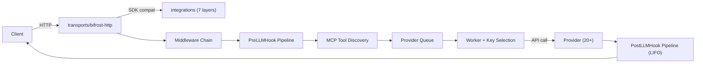

# Project Context: bifrost-llm-gateway
> Generated by verrueckt-cortex · 2026-04-03 · git:7533dbfa

## 1. Project Overview

Bifrost is a high-performance AI gateway that unifies 20+ LLM providers behind a single OpenAI-compatible API with ~11µs overhead at 5,000 RPS. It operates both as a standalone HTTP gateway binary and as an embeddable Go SDK, and also functions as an MCP gateway for tool-calling agents. The project is a Go multi-module workspace combined with a Next.js 15 management UI and Playwright e2e test suite.

**Type**: Monorepo (Go workspace — 14 go.mod files — plus Node.js packages)
**Stack**: Go 1.26.1, fasthttp, Next.js 15 / React 19, TypeScript, Tailwind CSS v4, Redux Toolkit, Zustand, GORM (SQLite/PostgreSQL), OpenTelemetry, zerolog, mcp-go

## 2. Architecture Flow

## 3. Key Paths

| Area | Path | Purpose |
|------|------|---------|
| Core engine | `core/` | Bifrost engine — provider abstraction, queue, worker pool |
| Shared types | `core/schemas/` | All shared Go types (48 files) — start here for data models |
| Provider impls | `core/providers/` | 20+ provider implementations; 9 delegate to openai.HandleOpenAI |
| MCP protocol | `core/mcp/` | MCP gateway implementation, Starlark sandboxing |
| Framework | `framework/` | configstore, logstore, vectorstore, kvstore, streaming, modelcatalog, encrypt |
| HTTP transport | `transports/bifrost-http/` | Gateway entry point — handlers/, integrations/, middleware |
| Plugins | `plugins/` | 9 plugin modules (otel, telemetry, and others), each with own go.mod |
| UI | `ui/` | Next.js 15 app — `ui/app/` (App Router), `ui/components/`, `ui/lib/`, `ui/hooks/` |
| Tests | `tests/` | E2E (Playwright), API (Newman), SDK integration (Python + TS) |
| Build | `Makefile` | 1300+ line build orchestration; `air` for hot reload |

## 4. Available Plugins / Tools

- **plugins/otel** — OpenTelemetry tracing and metrics integration
- **plugins/telemetry** — Prometheus metrics export
- **framework/vectorstore** — Weaviate, Qdrant, Pinecone, Redis adapters
- **framework/configstore** — Persistent gateway configuration (SQLite / PostgreSQL via GORM)
- **framework/logstore** — Request/response logging store
- **framework/kvstore** — Key-value store abstraction
- **framework/modelcatalog** — Model metadata registry
- **framework/encrypt** — Secret encryption helpers
- **transports/bifrost-http/integrations** — Drop-in SDK compatibility: OpenAI, Anthropic, and 5 others
- **core/mcp** — MCP tool-calling gateway with Starlark code-mode sandbox

## 5. Key References

| Document | Path | When to Use |
|----------|------|-------------|
| Project README | `README.md` | Overview, quickstart, deployment options |
| Docs source | `docs/` | Mintlify MDX documentation (mirrors docs.getbifrost.ai) |
| Docs README | `docs/README.md` | Docs contribution guide and structure |
| HTTP handlers | `transports/bifrost-http/handlers/` | 27 endpoint handlers — consult when adding/modifying routes |
| E2E tests | `tests/` | Playwright selectors use `data-testid="<entity>-<element>-<qualifier>"` |
| Terraform | `terraform/` | IaC for AWS ECS, Azure AKS, GCP GKE |
| Helm chart | `helm-charts/` | Kubernetes deployment chart |

## 6. Environment

| Tool | Status | Detail |
|------|--------|--------|
| gh | installed | repo `FrancisVarga/bifrost-llm-gateway` · authenticated |
| rtk | installed | **MANDATORY** — prefix ALL Bash commands with `rtk` |

> **RTK Enforcement**: `rtk` is available. ALL Bash tool invocations MUST be prefixed with `rtk`. Example: `rtk git status`, `rtk go build ./...`, `rtk pnpm install`. See global CLAUDE.md for full command reference.

## 7. Critical Conventions

| Convention | Rule |
|------------|------|
| Module commands | Run `go mod tidy` inside the specific module directory, not workspace root |
| Converter purity | All `To*Request` / `ToBifrost*Response` functions must be pure — no side effects, no logging, no HTTP |
| UI build output | `npm run build` in `ui/` copies static files to `transports/bifrost-http/ui/` |
| New provider | 8-step checklist: core impl, schemas, UI, OpenAPI, config schema, CI, docs, tests |
| E2E selectors | `data-testid="<entity>-<element>-<qualifier>"` — load-bearing, do not change without updating tests |
| Duration JSON | `time.Duration` in Go encodes as milliseconds integer in JSON |
| Post-hook order | LIFO — post-hooks run in reverse registration order for cleanup correctness |
| Pool leak detection | Build with `-tags pooldebug` to enable sync.Pool leak detection |
| Config reload | Atomic hot-swap via `atomic.Pointer` — zero downtime |
| Error strings | Lowercase, no trailing punctuation (Go standard) |
